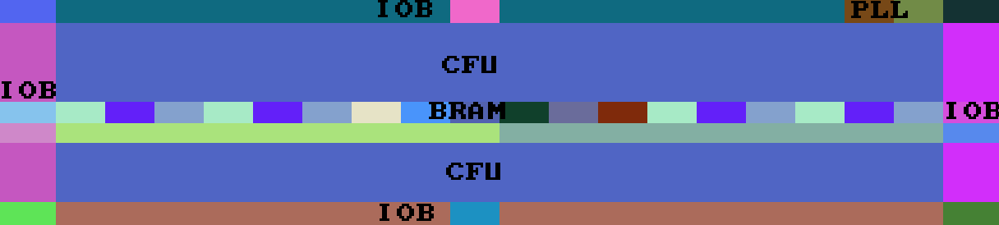
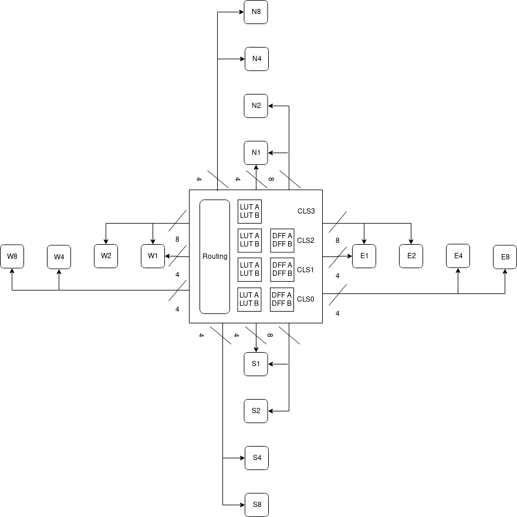
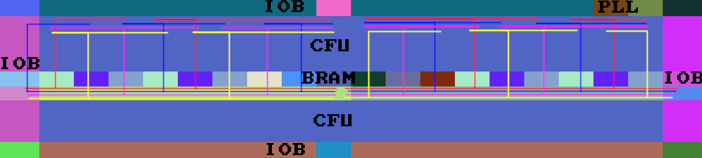
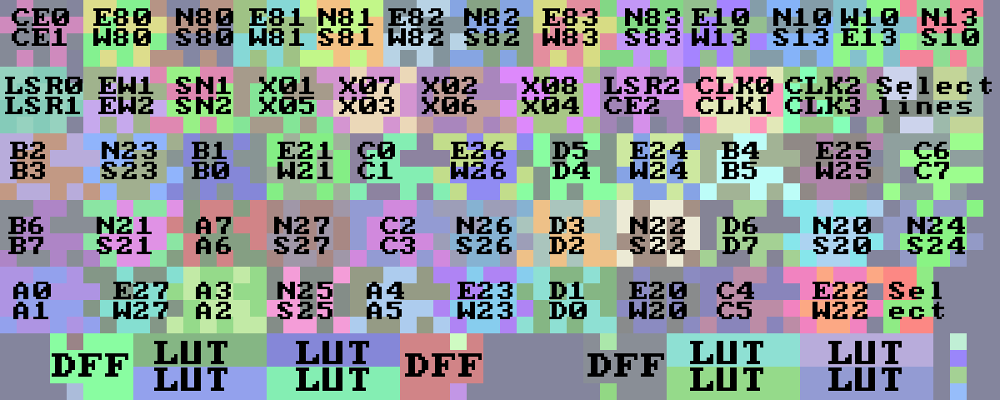

# Architecture

Gowin FPGAs have a LUT4 architecture common to many smaller FPGA architectures. The FPGA consist of a grid of tiles with I/O buffers around the edges, rows of special-function blocks such as BRAM, and a large grid configurable logic units.

Each Configurable logic unit consists of 8 LUT4s grouped in 4 slices, of which 3 have data flip-flops. Each slice shares certain resources such as clock inputs and reset lines.

Each LUT4 has 4 inputs and one output that is directly connected to the data flip-flop input. The LUT output can be used independently, as well as flipflop input D (although we do not generate such images at the moment, but we can unpack them correctly - in this case the SELx wire is the flipflop input). Each pair of flip flops has data in and out, clock, clock enable, and set/reset. Each pair of flip-flops can be configured for rising edge or falling edge sensitivity, and asynchronous or synchronous set or clear.

These tiles are connected with various multiplexers to adjacent tiles as well as global clock lines. Each tile has 8 tile-local wires, 4 one-hop wires of which 2 are shared between north/south and east/west, 8 two-hop wires with one-hop taps, and 4 eight-hop wires with four-hop taps. An overview of all wires can be seen below.

There are various inputs to the global clock routing, such as GCLK pins and PLL outputs. These are hardwired to the centre tile of the FPGA. In the center tile are some muxes that route one of the inputs to a certain spine. There are 4 primary and 4 secondary spines in each direction, running horizontally away from the cetre tile.

At every tile along the spine are two fuses that enable a primary/secondary tap that runs along the entire height of the FPGA. Each tile is hardwired to connect to one primary and/or one secondary tap. Each spine can therefore only be tapped at a few columns per side, depending on the size of the FPGA.

Each tile in the FPGA has one fuse that connects the vertically tap that runs through that tile to a branch that runs horizontally acros the FPGA. This one fuse controls both primary and secondary taps. In each tile GB0-3 correspond to the 4 primary branches, and GB4-7 to the secondary ones.

The bitstream consist of frames. Frames describe one row of bits on the FPGA tile grid. Frames are padded to full bytes, and verified with a CRC-16 checksum. These rows are stacked on top of each other to describe a bitmap that is overlaid on the FPGA tile grid.

The number of tiles on the grid depend on the specific FPGA model. A tile is roughly 60x24 bits, with I/O buffers and some special tiles being a few rows or columns larger. A common logic tile has the LUTs and flip-flops in the bottom 4 rows, with the top 20 rows being filled with multiplexers. An overview of the bitstream layout of LUTs, flip-flops, and multiplexers in a logic tile can be seen below.

