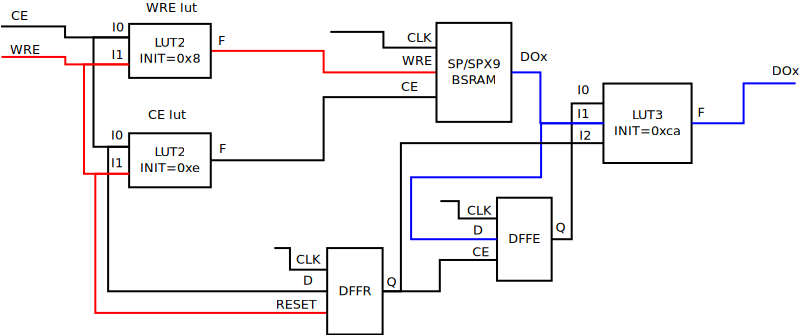
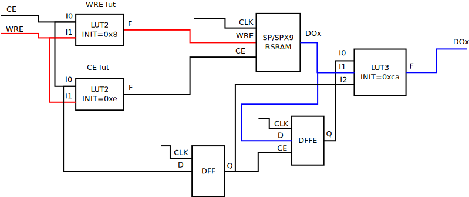
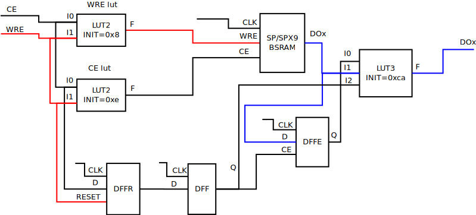
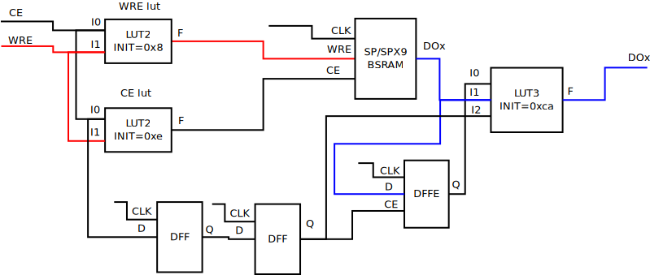
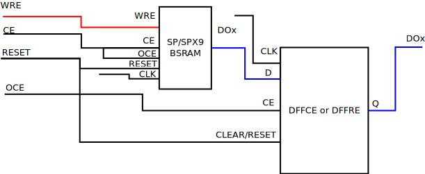
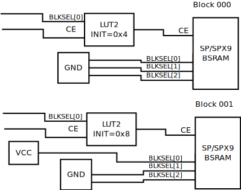

# BSRAM
## Single Port fix

In the images generated by Gowin IDE, "extra" primitives were found surrounding the BSRAM in some cases.
I honestly can’t figure out what memory problem they are fixing, but I think it makes sense to repeat this harness since BSRAM is a critical element for complex applications like RISCV or signal processing.

The technique is to generate an image for a very simple design with a single BSRAM primitive whose input and output signals are routed to IO pins - thus Gowin IDE cannot make assumptions about the nature of the signals and therefore does not optimize.  This point is important because the CE and WRE signals, being VCC or GND, can change the LUTs up to and including removing them completely. After this, examine the binary image to determine what elements suddenly appeared.

By the way, this is space for future optimization for us, but for now we assume the most difficult case - since CE and WRE are not constants.

Which elements are added to Single Port BSRAM depends on the chip, the reading mode and the writing mode - for example, for Tangnano4k (GW1NSR-4C) nothing is added at all, for Tangnano20k (GW2AR-18C) and Tangnano9C (GW1NR-9C) some elements are added, and for other chips - well, others.

I encountered this behavior on the SZFPGA board (GW1N-9) so for now I will describe it for this chip.

DOx are BSRAM outputs, so the primitives connected to this output must be repeated according to the number of outputs involved (1, 2, 4, ... 36).

One more note for the future - if these additional things are intended to correct some error in the time intervals, then they will need to be located in close proximity to the BSRAM.

### `READ_MODE=1'b0` (bypass) and `WRITE_MODE=1'b00` (normal):

### `READ_MODE=1'b0` (bypass) and `WRITE_MODE=1'b01` (write-through):

### `READ_MODE=1'b0` (bypass) and `WRITE_MODE=1'b10` (read-before-write):

### `READ_MODE=1'b1` (pipeline) and `WRITE_MODE=1'b00` (normal):

### `READ_MODE=1'b1` (pipeline) and `WRITE_MODE=1'b01` (write-through):

### `READ_MODE=1'b1` (pipeline) and `WRITE_MODE=1'b10` (read-before-write):

### Tangnano9k and Tangnano20k
For chips on these boards, no new elements are formed around the BSRAM, that is, we can conclude that whatever was broken in the previous families was fixed here. However, now the built-in output registers only work with 32 or 36 bits - with a different bit size, the internal registers are disabled (read mode is forced to switch to 1'b0 bypass) and external DFFs are added.

Which type is added, DFFCE or DFFRE, is determined by the SYNC parameter.

### BSRAM block selection
It seems that block selection using the `BLKSEL[2:0]` signals does not work as expected because the images generated by the Gowin IDE show an interesting re-communication of these signals.

The principle is this: instead of using the `BLKSEL[2:0]` ports, we connect them to constants, thereby making the BSRAM block statically selected, but add a LUT-based `BLKSEL[2:0]` signal decoder that manipulates the Clock Enable port. Of course, the decoder uses only dynamically changing `BLKSEL` networks - there’s no point in bothering with constant bits.

Here is an example of two blocks with a simple decoder:

When more dynamic bits are involved in `BLKSEL[2:0]`, higher order LUTs are used.

For Tangnano9k and Tangnano20k with data width of 32 or 36 bits, no additional manipulations were noticed, but for now we will add a decoder in these cases for simplicity.

### TangPrimer25k

SDPB/SDPX9B in TangPrimer25k with a width of 32/36 bits are divided into two primitives, each of which serves 16/18 bits.

#### 32/36 bits - 32/36 bits

This is the simplest case, when the widths of ports A and B are equal. In this case, almost all signals are connected in parallel between the two primitives, with the exception of the write mask and the ADA4 address line, which is used to write the most significant bytes to the next address. This is not necessary when reading, since all 32/36 bits are read in any case.

#### 32/36 bits - < 32 bits

The case where port B has a small width is more interesting. We still write 16/18 bits to two primitives, but we can no longer read as easily because we need to take 16/18 bits from one primitive or the other depending on the address.

Therefore, we add a LUT to each DOx output, which selects which primitive output to use depending on the state of the ADB4 address bit.

But there is a problem: these LUTs are very fast, and the memory has a delay of at least one clock cycle. To accurately simulate a single large memory primitive, we add a DFF1 delay register, which delays the ADB4 signal.

If the output register was used (`READMODE=1'b1`), we need to delay the switching of primitives for one more clock cycle and also take into account the OCE input. To do this, we add DFF3. 

Another complication arises if at least one of the BLKSEB inputs is not constant—in this case, we add a decoder `LUT 55`, whose `INIT` parameter is equal to `16 * (1 << BLK_SEL_1)`.

# TODO
  - Explore DPB, SDPB and pROM

