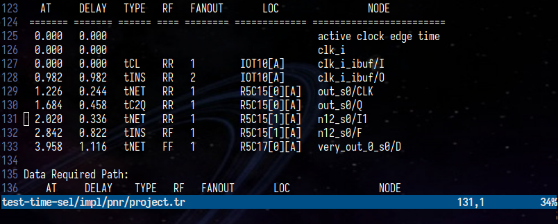
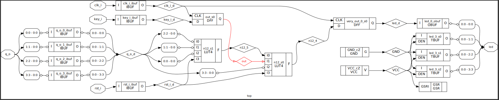
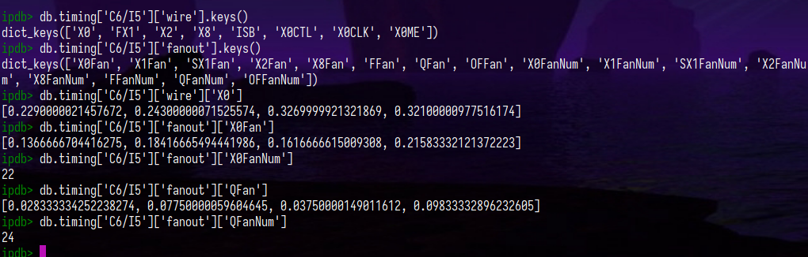
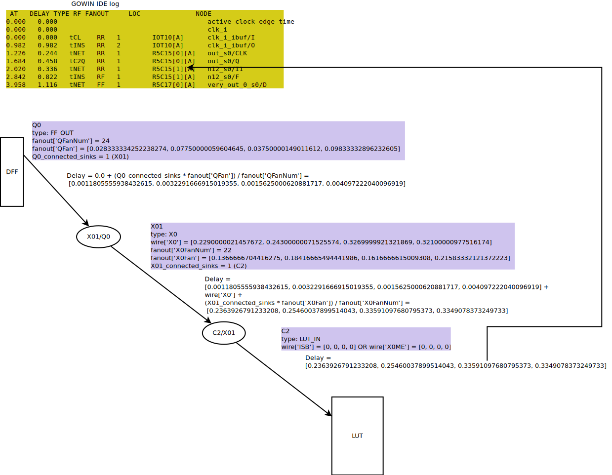
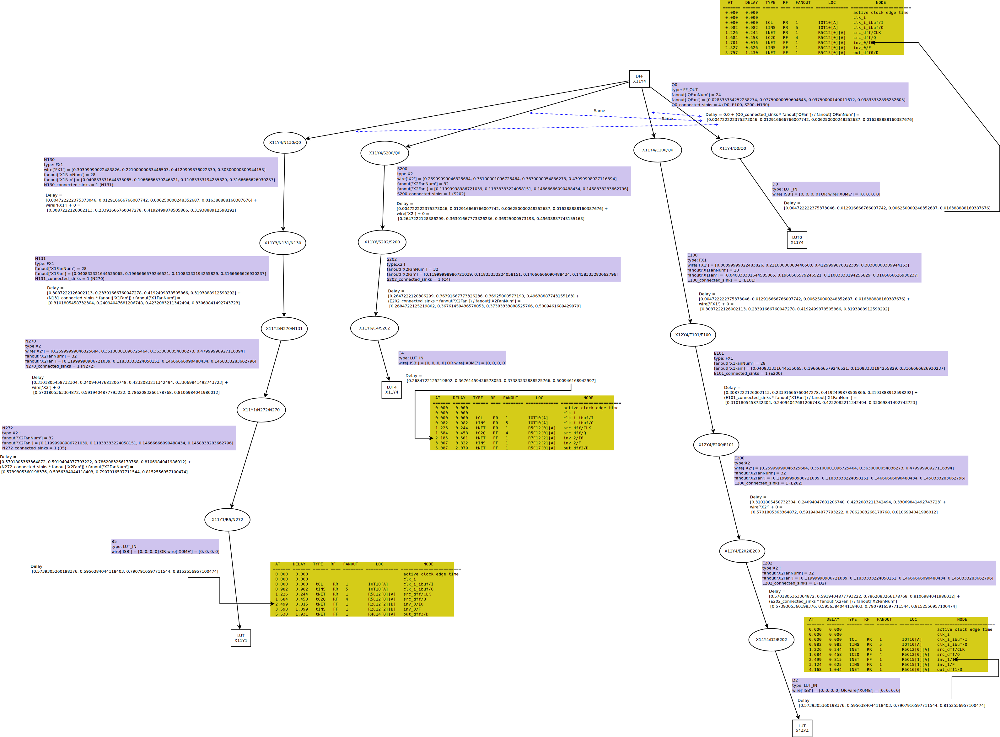
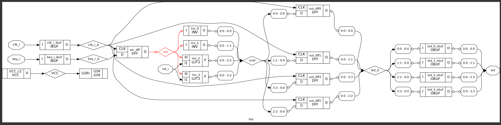
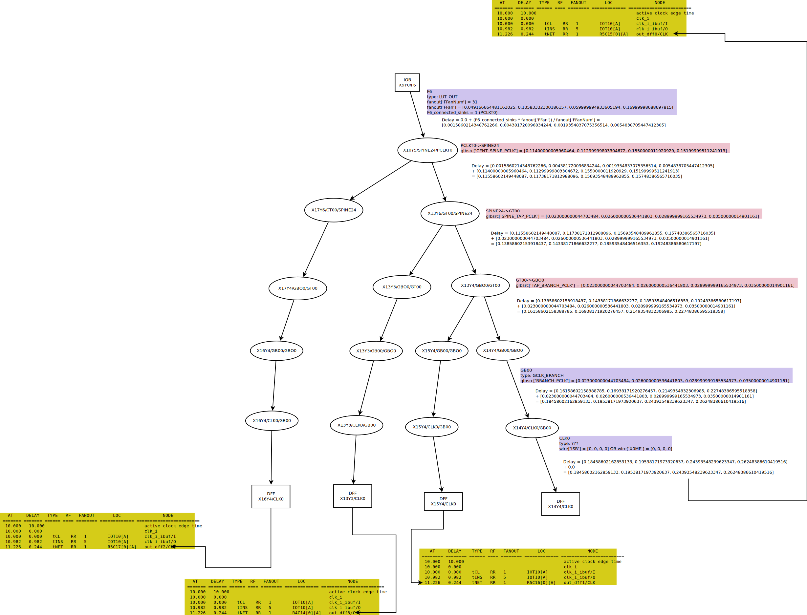

# Calculating network delay in nextpnr

The network delay is made up of the wire and pip delays as seen in the following nextpnr code snippet:

``` C++
        while (cursor != WireId() && cursor != src_wire) {
            auto it = net_info->wires.find(cursor);


            if (it == net_info->wires.end())
                break;


            PipId pip = it->second.pip;
            if (pip == PipId())
                break;


            delay = delay + getPipDelay(pip);
            delay = delay + getWireDelay(cursor);
            cursor = getPipSrcWire(pip);
        }
```

[Context::getNetinfoRouteDelayQuad](https://github.com/YosysHQ/nextpnr/blob/764b5402e81be403658509d83950dc5ac631d29b/common/kernel/context.cc#L191-L204)

`getWireDelay` is very simple at the moment - there's no delay.

`getPipDelay` is more complicated. Let's leave aside capacitance and resistance for now and focus on where `int_delay` comes from.

``` C++
        auto &pip_data = chip_pip_info(chip_info, pip);
        auto pip_tmg = get_pip_timing(pip_data);
        if (pip_tmg != nullptr) {
            // TODO: multi corner analysis
            WireId src = getPipSrcWire(pip);			
			uint64_t input_res = fast_pip_delays ? 0 : (drive_res.count(src) ? drive_res.at(src) : 0);
			uint64_t input_cap = fast_pip_delays ? 0 : (load_cap.count(src) ? load_cap.at(src) : 0);
            auto src_tmg = get_node_timing(src);
            if (src_tmg != nullptr)
                input_res += (src_tmg->res.slow_max / 2);
            // Scale delay (fF * mOhm -> ps)
            delay_t total_delay = (input_res * input_cap) / uint64_t(1e6);
            total_delay += pip_tmg->int_delay.slow_max;


            WireId dst = getPipDstWire(pip);
            auto dst_tmg = get_node_timing(dst);
            if (dst_tmg != nullptr) {
                total_delay +=
                        ((pip_tmg->out_res.slow_max + uint64_t(dst_tmg->res.slow_max) / 2) * dst_tmg->cap.slow_max) /
                        uint64_t(1e6);
            }
			return DelayQuad(total_delay);
		}

```

Specific data like time delays we can only get from verndor's files, so let's see what we have in the database. Let's take a board like Tangano9k. We have information about speed grades copied to the chip database:

``` python
db.timing.keys()
dict_keys(['C5/I4', 'C5/I4_LV', 'C6/I5', 'C6/I5_LV', 'ES', 'ES_LV', 'A4', 'A4_LV', '8', '9', '10', '11', 'C7/I6', 'C7/I6_LV'])
```

In each grade, delays are stored by group:

``` python
ipdb> db.timing['C6/I5'].keys()
dict_keys(['lut', 'alu', 'sram', 'dff', 'bram', 'fanout', 'glbsrc', 'hclk', 'iodelay', 'wire'])
```

In each group, delays are assigned a class:

``` python
ipdb> db.timing['C6/I5']['wire'].keys()
dict_keys(['X0', 'FX1', 'X2', 'X8', 'ISB', 'X0CTL', 'X0CLK', 'X0ME'])
ipdb> db.timing['C6/I5']['wire']['X2']
[0.25999999046325684, 0.35100001096725464, 0.3630000054836273, 0.47999998927116394]
```

This quadruple number presumably stands for delays depending on the combination of edges at the input and output:

Falling->Falling, Falling->Rising, Raising->Raising, Raising->Falling.

Currently, [nextpnr](https://github.com/YosysHQ/nextpnr/blob/764b5402e81be403658509d83950dc5ac631d29b/himbaechel/uarch/gowin/gowin_arch_gen.py#L1420-L1426) collapses these four numbers into two: minimum and maximum delay, so further down in this document, when we search vendor IDE reports for delay, we shouldn't be picky about which column from FF->FR->RR->RF we take.

``` python
    def group_to_timingvalue(group):
        # if himbaechel ever recognises unateness, this should match that order.
        ff = int(group[0] * 1000)
        fr = int(group[1] * 1000)
        rr = int(group[2] * 1000)
        rf = int(group[3] * 1000)
        return TimingValue(min(ff, fr, rf, rr), max(ff, fr, rf, rr))
```

Let's especially note the `fanout` group, which will come in handy during these manipulations with capacitances and resistances:

``` python
ipdb> db.timing['C6/I5']['fanout'].keys()
dict_keys(['X0Fan', 'X1Fan', 'SX1Fan', 'X2Fan', 'X8Fan', 'FFan', 'QFan', 'OFFan', 'X0FanNum', 'X1FanNum', 'SX1FanNum', 'X2FanNum', 'X8FanNum', 'FFanNum', 'QFanNum', 'OFFanNum'])
```

# Possible interpretation of the vendor report

If you compile with IDE (from command line, in TCL script. Perhaps there is such a thing in graphical UI too, I didn't look), if you set `-gen_text_timing_rpt 1` key, then a report file will be generated, where you can see data about signal delays on different parts of the design, like this:




The DELAY column is the delay value at a certain section, the exact formula is unknown, we will use a more/less plausible mechanism of turning quadruple numbers from vendor files into this single delay value.

TYPE is the type of section. Presumably tNET is wires and PIPs, tINS is primitive, tC2Q is unknown, presumably the delay between the edge on CLK to the edge on Q at DFF.

We are interested in tNET type sections.

RF - is what happens in this section, let's say FR means there will be inversion of the signal. 

NODE - name of primitive/name of port. For networks (tNETs) it's a sink.

Let's look at a simple design to understand how these quadruple numbers from the vendor files are used.



The highlighted network has a delay of 0.336. Let's see how we can get this. First of all, this is a `RR` section, so we will only take the third number of each quadruple.

If we unpack the image, we can see what wires are involved in this network:

`R5C15_Q0 -> R5C15_X01 -> R5C15_C2`

Why the `C2` port you ask? Unfortunately, the vendor IDE thinks it is possible to arbitrarily swap LUT inputs even after generating reports. This makes it very difficult to find patterns. So in this particular case I found where the network is connected and it is port `C2`.


Let's see what we have in the base for the `Q` and `X01`:



No doubt we take the third number from `wires` for `X0` - there is no getting away from this delay. For `Q` we do not have such data and it is understandable - it is the output of `DFF` and so whatever the internal delay is, it belongs to the flip-flop itself.

Next we have fanout data, but in pure `QFan` and `X0Fan` are too large - remember we have 0.336 in the report, now we have already gained 0.3269999921321869 due to the internal delay of `X0`.


Let's assume that `QFan` and `X0Fan` are the maximum delay provided that all `QFanNum` and `X0FanNum` wires are connected respectively, then we can use only a small part of this delay - proportional to the wires connected.


In our case, only one wire out of 24 for `Q` and one wire out of 22 for `X0` are used:

```
delay = 1/QFanNum * QFan + 0.3269999921321869 + 1/X0FanNum * X0Fan
delay = 1/24 * QFan + 0.3269999921321869 + 1/22 * X0Fan
delay = 1/24 * 0.03750000149011612 + 0.3269999921321869 + 1/22 * 0.1616666615009308
delay = 0.33591097680795373
```

I'd say in this case we've pretty much guessed the formula. Now we can move on to comparing nextpnr's calculations with the vendor's report, given our knowledge of how the total network delay is obtained.


# Comparison with nextpnr

Let's describe the theoretical calculation of delays in the vendor IDE in the form of a diagram:



Note about the last wire `C2` - we model PIPs so that they connect two wires, so we have a wire `C2` although it may not actually be there as a piece of copper - it is after all only the input of the primitive. It clearly has no fanout and whatever delay it has is inside the primitive and is not related to network delays.

That's why I took here a suitable element from vendor tables, which has all zeros and an incomprehensible name:)

To compare delay values in nextpnr and IDE we use python mode.

``` shell
$ nextpnr-himbaechel --device GW1NZ-LV1QN48C6/I5 --pre-pack ~/src/nextpnr/python/interactive.py --vopt cst=t1k.cst --json top-synth.json
```

I have the nextpnr repository in `~/src/nextpnr`, and the last argument is any json after synthesis - it doesn't matter which one.


``` python
>>> net = ctx.createNet('test')
>>> ctx.bindWire('X14Y4/Q0', net, STRENGTH_WEAK)
>>> ctx.bindPip('X14Y4/X01/Q0', net, STRENGTH_WEAK)
>>> ctx.bindPip('X14Y4/C2/X01', net, STRENGTH_WEAK)
>>> dly0 = ctx.getPipDelay('X14Y4/X01/Q0').maxDelay()
>>> dly0
0
>>> dly1 = ctx.getPipDelay('X14Y4/C2/X01').maxDelay()
>>> dly1
334
>>> dly0 + dly1
334
```

0.334 vs 0.336 - we got close enough!

Now let's see what the situation is like when there are multiple sinks in the network.


Let's take all four branches of the 'out' net from the report:

```
   AT     DELAY   TYPE   RF   FANOUT       LOC                NODE
 ======= ======= ====== ==== ======== ============= ========================
  0.000   0.000                                      active clock edge time
  0.000   0.000                                      clk_i
  0.000   0.000   tCL    RR   1        IOT10[A]      clk_i_ibuf/I
  0.982   0.982   tINS   RR   5        IOT10[A]      clk_i_ibuf/O
  1.226   0.244   tNET   RR   1        R5C12[0][A]   src_dff/CLK
  1.684   0.458   tC2Q   RF   4        R5C12[0][A]   src_dff/Q
  1.701   0.016   tNET   FF   1        R5C12[0][A]   inv_0/I0
  2.327   0.626   tINS   FF   1        R5C12[0][A]   inv_0/F
  3.757   1.430   tNET   FF   1        R5C15[0][A]   out_dff0/D
```

```
   AT     DELAY   TYPE   RF   FANOUT       LOC                NODE
 ======= ======= ====== ==== ======== ============= ========================
  0.000   0.000                                      active clock edge time
  0.000   0.000                                      clk_i
  0.000   0.000   tCL    RR   1        IOT10[A]      clk_i_ibuf/I
  0.982   0.982   tINS   RR   5        IOT10[A]      clk_i_ibuf/O
  1.226   0.244   tNET   RR   1        R5C12[0][A]   src_dff/CLK
  1.684   0.458   tC2Q   RF   4        R5C12[0][A]   src_dff/Q
  2.499   0.815   tNET   FF   1        R5C15[1][A]   inv_1/I0
  3.124   0.625   tINS   FR   1        R5C15[1][A]   inv_1/F
  4.168   1.044   tNET   RR   1        R5C16[0][A]   out_dff1/D
```

```
     AT     DELAY   TYPE   RF   FANOUT       LOC                NODE
 ======= ======= ====== ==== ======== ============= ========================
  0.000   0.000                                      active clock edge time
  0.000   0.000                                      clk_i
  0.000   0.000   tCL    RR   1        IOT10[A]      clk_i_ibuf/I
  0.982   0.982   tINS   RR   5        IOT10[A]      clk_i_ibuf/O
  1.226   0.244   tNET   RR   1        R5C12[0][A]   src_dff/CLK
  1.684   0.458   tC2Q   RF   4        R5C12[0][A]   src_dff/Q
  2.185   0.501   tNET   FF   1        R7C12[2][A]   inv_2/I0
  3.007   0.822   tINS   FF   1        R7C12[2][A]   inv_2/F
  5.087   2.079   tNET   FF   1        R5C17[0][A]   out_dff2/D
```

```
   AT     DELAY   TYPE   RF   FANOUT       LOC                NODE
 ======= ======= ====== ==== ======== ============= ========================
  0.000   0.000                                      active clock edge time
  0.000   0.000                                      clk_i
  0.000   0.000   tCL    RR   1        IOT10[A]      clk_i_ibuf/I
  0.982   0.982   tINS   RR   5        IOT10[A]      clk_i_ibuf/O
  1.226   0.244   tNET   RR   1        R5C12[0][A]   src_dff/CLK
  1.684   0.458   tC2Q   RF   4        R5C12[0][A]   src_dff/Q
  2.499   0.815   tNET   FF   1        R2C12[2][B]   inv_3/I0
  3.598   1.099   tINS   FF   1        R2C12[2][B]   inv_3/F
  5.530   1.931   tNET   FF   1        R4C14[0][A]   out_dff3/D
```

Unpacked net:

```
R5C12_Q0 -> R5C12_D0
R5C12_Q0 -> R5C12_E100 -> R5C13_E101 -> R5C13_E200 -> R5C15_E202 -> R5C15_D2
R5C12_Q0 -> R5C12_S200 -> R7C12_S202 -> R7C12_C4
R5C12_Q0 -> R5C12_N130 -> R4C12_N131 -> R4C12_N270 -> R2C12_N272 -> R2C12_B5
```

Let's draw diagrams for all branches by doing the maths for all four numbers and see if there is a column in the vendor's data (the same for all branches!) that gives us the delay from the report (remember that nextpnr doesn't care which column the vendor uses as it only takes into account the minimum and maximum of all four).



``` python
>>> net = ctx.createNet('test')
>>> ctx.bindWire('X11Y4/Q0', net, STRENGTH_WEAK)
>>> ctx.bindPip('X11Y4/D0/Q0', net, STRENGTH_WEAK)
>>> ctx.bindPip('X11Y4/E100/Q0', net, STRENGTH_WEAK)
>>> ctx.bindPip('X12Y4/E200/E101', net, STRENGTH_WEAK)
>>> ctx.bindPip('X14Y4/D2/E202', net, STRENGTH_WEAK)
>>> ctx.bindPip('X11Y4/S200/Q0', net, STRENGTH_WEAK)
>>> ctx.bindPip('X11Y6/C4/S202', net, STRENGTH_WEAK)
>>> ctx.bindPip('X11Y4/N130/Q0', net, STRENGTH_WEAK)
>>> ctx.bindPip('X11Y3/N270/N131', net, STRENGTH_WEAK)
>>> ctx.bindPip('X11Y1/B5/N272', net, STRENGTH_WEAK)
>>> branch_0_dly = ctx.getPipDelay('X11Y4/D0/Q0').maxDelay(); branch_0_dly
0
>>> branch_1_dly = ctx.getPipDelay('X11Y4/E100/Q0').maxDelay() + ctx.getPipDelay('X12Y4/E200/E101').maxDelay() + ctx.getPipDelay('X14Y4/D2/E202').maxDelay(); branch_1_dly
891
>>> branch_2_dly = ctx.getPipDelay('X11Y4/S200/Q0').maxDelay() + ctx.getPipDelay('X11Y6/C4/S202').maxDelay(); branch_2_dly
485
>>> branch_3_dly = ctx.getPipDelay('X11Y4/N130/Q0').maxDelay() + ctx.getPipDelay('X11Y3/N270/N131').maxDelay() + ctx.getPipDelay('X11Y1/B5/N272').maxDelay(); branch_3_dly
891
>>> ((0.016 - 0) + (0.815 - 0.891) + (0.501 - 0.485) + (0.815 - 0.891)) / 4
-0.03000000000000003
```

So nextpnr calculates on average with an error of 0.03. This is true for "normal" networks, including wires such as EW and SN and the inputs and outputs of large LUTs (MUX2_LUT5 for example).

# Global clock networks

An interesting category of wires is the global clock network. And it is not only that the outputs of this network are in every cell, but the most important thing is that the number of PIPs on the way to any cell is the same: central MUX -> spine -> tap -> branch.

We use the last design, but now examine the four DFFs (out_dff0-3), specifically their clock inputs.



Vendor IDE reports (sake of clarity, everything after DFF's CLK has been dropped):

```
    AT     DELAY    TYPE   RF   FANOUT       LOC                NODE           
 ======== ======== ====== ==== ======== ============= ======================== 
  10.000   10.000                                      active clock edge time  
  10.000   0.000                                       clk_i                   
  10.000   0.000    tCL    RR   1        IOT10[A]      clk_i_ibuf/I            
  10.982   0.982    tINS   RR   5        IOT10[A]      clk_i_ibuf/O            
  11.226   0.244    tNET   RR   1        R5C15[0][A]   out_dff0/CLK            
```

```
    AT     DELAY    TYPE   RF   FANOUT       LOC                NODE           
 ======== ======== ====== ==== ======== ============= ======================== 
  10.000   10.000                                      active clock edge time  
  10.000   0.000                                       clk_i                   
  10.000   0.000    tCL    RR   1        IOT10[A]      clk_i_ibuf/I            
  10.982   0.982    tINS   RR   5        IOT10[A]      clk_i_ibuf/O            
  11.226   0.244    tNET   RR   1        R5C16[0][A]   out_dff1/CLK            
```

```
    AT     DELAY    TYPE   RF   FANOUT       LOC                NODE           
 ======== ======== ====== ==== ======== ============= ======================== 
  10.000   10.000                                      active clock edge time  
  10.000   0.000                                       clk_i                   
  10.000   0.000    tCL    RR   1        IOT10[A]      clk_i_ibuf/I            
  10.982   0.982    tINS   RR   5        IOT10[A]      clk_i_ibuf/O            
  11.226   0.244    tNET   RR   1        R5C17[0][A]   out_dff2/CLK            
```

```
    AT     DELAY    TYPE   RF   FANOUT       LOC                NODE           
 ======== ======== ====== ==== ======== ============= ======================== 
  10.000   10.000                                      active clock edge time  
  10.000   0.000                                       clk_i                   
  10.000   0.000    tCL    RR   1        IOT10[A]      clk_i_ibuf/I            
  10.982   0.982    tINS   RR   5        IOT10[A]      clk_i_ibuf/O            
  11.226   0.244    tNET   RR   1        R4C14[0][A]   out_dff3/CLK            
```

We note at once that regardless of the location of the sinks in different columns and different rows, the delay is the same and equal to 0.244. 


```
R7C14_SPINE24 -> R7C14_GT00 - R5C14_GT00 -> R5C14_GBO0 -> R5C15_GB00 -> R5C15_CLK0
R7C14_SPINE24 -> R7C14_GT00 - R5C14_GT00 -> R5C14_GBO0 -> R5C16_GB00 -> R5C16_CLK0
R7C18_SPINE24 -> R7C18_GT00 - R5C18_GT00 -> R5C18_GBO0 -> R5C17_GB00 -> R5C17_CLK0
R7C14_SPINE24 -> R7C14_GT00 - R4C14_GT00 -> R4C14_GBO0 -> R4C14_GB00 -> R4C14_CLK0
```

We have common sections and forks, but this has no effect on the resulting delay, so we can forget about fanout when looking for a formula.

Let us try to assume how this delay can be calculated.



Let's see how well nextpnr uses the specified classes for global wires:

``` python
>>> net = ctx.createNet("test")
>>> ctx.bindWire("X9Y0/F6", net, STRENGTH_WEAK)
>>> pips = ['X10Y5/SPINE24/PCLKT0', 'X13Y6/GT00/SPINE24', 'X13Y4/GBO0/GT00', 'X14Y4/CLK0/GB00']
>>>
>>> for pip in pips:
...     ctx.bindPip(pip, net, STRENGTH_WEAK)
...
>>> delay = 0
>>> for pip in pips:
...     pip_del = ctx.getPipDelay(pip).maxDelay()
...     delay += pip_del
...     print(pip, pip_del)
...
X10Y5/SPINE24/PCLKT0 155
X13Y6/GT00/SPINE24 35
X13Y4/GBO0/GT00 35
X14Y4/CLK0/GB00 35
>>> print(delay)
260
>>>
```

.240 vs .260 - that's good enough.

# Inside the primitives

Looking into the composition of the GW1NZ-1 chip we will see what we have:
 - 1152 LUTs
 - 864 DFFs
 - 4 BSRAM
 - 1 PLL

 That is, LUTs + DFFs make up ~99% of all elements. So let's see how well nextpnr counts delays in these elements.

Take any branch of the last four considered:

```
   AT     DELAY   TYPE   RF   FANOUT       LOC                NODE
 ======= ======= ====== ==== ======== ============= ========================
  0.000   0.000                                      active clock edge time
  0.000   0.000                                      clk_i
  0.000   0.000   tCL    RR   1        IOT10[A]      clk_i_ibuf/I
  0.982   0.982   tINS   RR   5        IOT10[A]      clk_i_ibuf/O
  1.226   0.244   tNET   RR   1        R5C12[0][A]   src_dff/CLK
  1.684   0.458   tC2Q   RF   4        R5C12[0][A]   src_dff/Q
  1.701   0.016   tNET   FF   1        R5C12[0][A]   inv_0/I0
  2.327   0.626   tINS   FF   1        R5C12[0][A]   inv_0/F
  3.757   1.430   tNET   FF   1        R5C15[0][A]   out_dff0/D
```

DFF for starters. We have a line with type tC2Q, which with a very high probability means a delay between edges of input CLK and output Q.

Let's see what we have in the vendor tables:

``` python
ipdb> for rk, rd in db.timing['C6/I5']['dff'].items():
    print(rk, rd)

di_clksetpos [0.25, 0.25, 0.3999999761581421, 0.3999999761581421]
di_clksetneg [0.25, 0.25, 0.3999999761581421, 0.3999999761581421]
di_clkholdpos [0.0, 0.0, 0.0, 0.0]
di_clkholdneg [0.0, 0.0, 0.0, 0.0]
ce_clksetpos [0.03750000149011612, 0.03750000149011612, 0.04333333298563957, 0.04333333298563957]
ce_clksteneg [0.03750000149011612, 0.03750000149011612, 0.04333333298563957, 0.04333333298563957]
ce_clkholdpos [0.01249999925494194, 0.01249999925494194, 0.014999998733401299, 0.014999998733401299]
ce_clkholdneg [0.01249999925494194, 0.01249999925494194, 0.014999998733401299, 0.014999998733401299]
lsr_clksetpos_syn [0.03750000149011612, 0.03750000149011612, 0.04333333298563957, 0.04333333298563957]
lsr_clksetneg_syn [0.03750000149011612, 0.03750000149011612, 0.04333333298563957, 0.04333333298563957]
lsr_clkholdpos_syn [0.01249999925494194, 0.01249999925494194, 0.014999998733401299, 0.014999998733401299]
lsr_clkholdneg_syn [0.01249999925494194, 0.01249999925494194, 0.014999998733401299, 0.014999998733401299]
clk_qpos [0.3333333134651184, 0.3333333134651184, 0.4583333134651184, 0.4583333134651184]
clk_qneg [0.3333333134651184, 0.3333333134651184, 0.4583333134651184, 0.4583333134651184]
lsr_q [0.8749999403953552, 1.25, 1.711666464805603, 1.8600000143051147]
lsr_clksetpos_asyn [0.03750000149011612, 0.03750000149011612, 0.04333333298563957, 0.04333333298563957]
lsr_clksetneg_asyn [0.03750000149011612, 0.03750000149011612, 0.04333333298563957, 0.04333333298563957]
lsr_clkholdpos_asyn [0.01249999925494194, 0.01249999925494194, 0.014999998733401299, 0.014999998733401299]
lsr_clkholdneg_asyn [0.01249999925494194, 0.01249999925494194, 0.014999998733401299, 0.014999998733401299]
clk_clk [1.25, 1.25, 1.25, 1.25]
lsr_lsr [2.5, 2.5, 2.5, 2.5]
ipdb>
```

The records give us exactly the 0.458 we're looking for.

``` python
clk_qpos [0.3333333134651184, 0.3333333134651184, 0.4583333134651184, 0.4583333134651184]
clk_qneg [0.3333333134651184, 0.3333333134651184, 0.4583333134651184, 0.4583333134651184]
```

Data from these tables is read nextpnr

``` C++
            elif group == "dff":
                for reset_type in ('', 'P', 'C', 'S', 'R'):
                    for clock_enable in ('', 'E'):
                        cell_name = "DFF{}{}".format(reset_type, clock_enable)
                        dff = tmg.add_cell_variant(speed, cell_name)
                        dff.add_setup_hold("CLK", "D", ClockEdge.RISING, group_to_timingvalue(arc["di_clksetpos"]), group_to_timingvalue(arc["di_clkholdpos"]))
                        dff.add_setup_hold("CLK", "CE", ClockEdge.RISING, group_to_timingvalue(arc["ce_clksetpos"]), group_to_timingvalue(arc["ce_clkholdpos"]))
                        dff.add_clock_out("CLK", "Q", ClockEdge.RISING, group_to_timingvalue(arc["clk_qpos"]))

...
```

and are used almost identically to the vendor report, see clk-to-q line (well, considering 3 vs. 2 decimal places).

```
Info: Critical path report for clock 'clk_IBUF_I_O' (posedge -> posedge):
Info:       type curr  total name
Info:   clk-to-q  0.46  0.46 Source ctr_q_DFFE_Q_25.Q
Info:    routing  0.41  0.87 Net ctr_q[0] (13,1) -> (14,1)
Info:                          Sink ctr_q_DFFE_Q_24_D_ALU_SUM_CIN_ALU_COUT.I1
Info:                           prediction: 0.100000 ns estimate: 0.300000 ns
Info:                  0.412 X14Y1/B1/E131
Info:                  0.000 X13Y1/E130/Q0
```

Now LUTs. Let's see what we have in the vendor tables. There seems to be a significant difference between inputs I0-3 (or in vendor symbols A-D):

``` python
ipdb> for rk, rd in db.timing['C6/I5']['lut'].items():
    print(rk, rd)

a_f [0.7260000109672546, 0.7319999933242798, 1.0260000228881836, 1.031999945640564]
b_f [0.7239999771118164, 0.7310000061988831, 1.0609999895095825, 1.0989999771118164]
c_f [0.5559999942779541, 0.6019999980926514, 0.8019999861717224, 0.8220000267028809]
d_f [0.38499999046325684, 0.3720000088214874, 0.625, 0.6259999871253967]
a_ofx [0.8240000009536743, 0.8209999799728394, 1.1759999990463257, 1.180999994277954]
b_ofx [0.8219999670982361, 0.8199999928474426, 1.2109999656677246, 1.2480000257492065]
c_ofx [0.6539999842643738, 0.6909999847412109, 0.9520000219345093, 0.9710000157356262]
d_ofx [0.4829999804496765, 0.4610000252723694, 0.7749999761581421, 0.7749999761581421]
m0_ofx0 [0.3370000123977661, 0.33399999141693115, 0.47200000286102295, 0.43700000643730164]
m1_ofx1 [0.2750000059604645, 0.3319999873638153, 0.3880000114440918, 0.5019999742507935]
fx_ofx1 [0.06599999964237213, 0.09399999678134918, 0.1770000010728836, 0.16300000250339508]
ipdb>
```

So let's see exactly which LUT input was used:

```
R5C12_Q0 -> R5C12_D0
```

D is used and it matches exactly the delay in the report:

```
  2.327   0.626   tINS   FF   1        R5C12[0][A]   inv_0/F
```

Now let's see what nextpnr does, it's worth noting here that because we need to find a variant specifically with D->F we use examples/nanolcd for tangnano1k because there are a lot of LUTs there.

```
Info:      logic  0.62  6.91 Source D1.LCD_G_LUT3_F_I1_LUT3_F_I1_LUT3_I0_F_LUT3_I1_F_LUT4_F_1.F
Info:    routing  0.00  6.91 Net D1.LCD_G_LUT3_F_I1_LUT3_F_I1_LUT3_I0_F_LUT3_I1_F[3] (11,2) -> (11,2)
Info:                          Sink D1.LCD_B_LUT2_F_I1_LUT4_F_1_I2_LUT2_I0_F_DFFC_Q.D
Info:                           prediction: 0.000000 ns estimate: 0.200000 ns
Info:                  0.000 X11Y2/XD4/F4
```

Here we have D4->F4 = 0.62 vs 0.626. 


