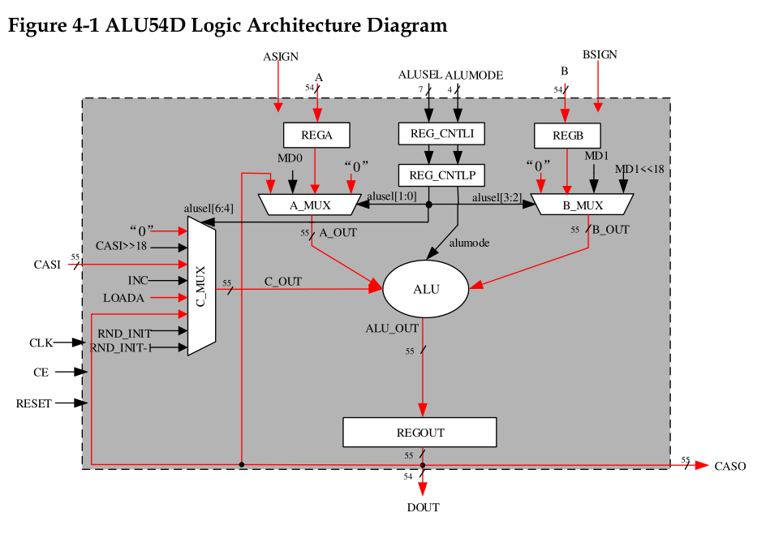
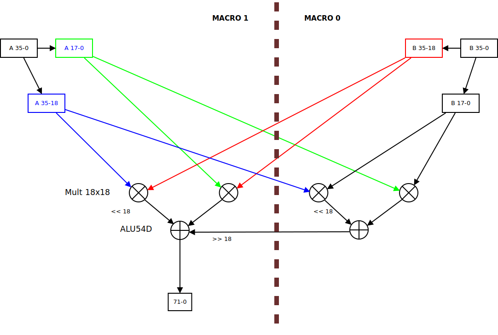

# DSP
## Accumulator in ALU and modes

The diagram in the Gowin documentation shows many things that are not described anywhere and which are not clear how to use (see, for example, RND_INIT and RND_INIT-1 - there must be some very funny signals). But it will definitely shed light on some interesting details.

ALU can operate in three modes:

 - 0: accumulator value +/- A +/- B
 - 1: accumulator value +/- B + CASI
 - 2: A +/- B + CASI

Why exactly such modes is connected with the organization of the accumulator itself - it is formed from the REGOUT register and one of the MUXs: C_MUX or A_MUX, which can receive a signal from the ALU output.
B_MUX does not have this feature and is therefore used in all three modes.

If we use A as an operand, then the accumulator is formed using C_MUX, and if we need CASI, then using A_MUX, but then we can no longer use A.

And another interesting point follows from the diagram: REGOUT must function as a register, that is, the parameter of the OUT_REG primitive must be set to 1'b1. If this is not done, the accumulator simply will not function properly.

## Mult36x36

The DSP multiplies such large 36-bit numbers by dividing them into pieces of 18 bits and further multiplies with each using 4 18x18 multipliers.

Next, two ALU54Ds come into play, which can shift one of the operands 18 bits to the left before adding. In addition, the ALU in Macro 1 operates in the addition mode of three operands (A, B and CASI), while CASI is shifted 18 bits to the right (C_MUX can do this - see above).

