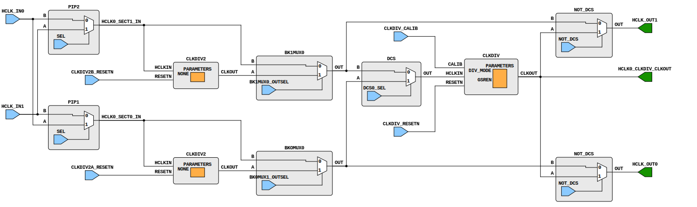

# HCLK

The High-speed CLocK tiles house the `CLKDIV` and `CLKDIV2` bels, among other functions. `CLKDIV` can drive `IOLOGIC`'s `FCLK` (via `HCLK_OUT`) but can also be used as a generic clock source. In contrast, the output of `CLKDIV2` can not be used as a generic clock source; however it can drive `CLKDIV`'s `HCLKIN`, `IOLOGIC`'s `FCLK`, and (per Gowin's documentation), PLLs.

The above diagram shows a prototypical HCLK. The GW1N-9C notably bucks this trend, having some wires repurposed, presumably to enable more direct connections by bypassing some fuses and muxes. It is also worthy of note that in the GW1N-9C, CLKDIV's CLKOUT cannot be connected directly to HCLK_OUT, and must thus take a roundtrip through the centre tiles.

As a general rule, signals in one HCLK section are not allowd to connect to another HCLK section. As such, when the input to CLKDIV comes from one HCLK section, it's output must also go to the same section. For ease with following this rule in PnR, the current implementation of HCLK pretends that there are two `CLKDIVs` rather than one. The GW1N-9C once again breaks the norm, having special wires that connect the output of CLKDIV2 in the upper sections to HCLK_OUT in the lower sections.

`HCLKMUX` (for sharing input signals between HCLKs) and `HCLKEN` are currently undocumented and unsupported ;).