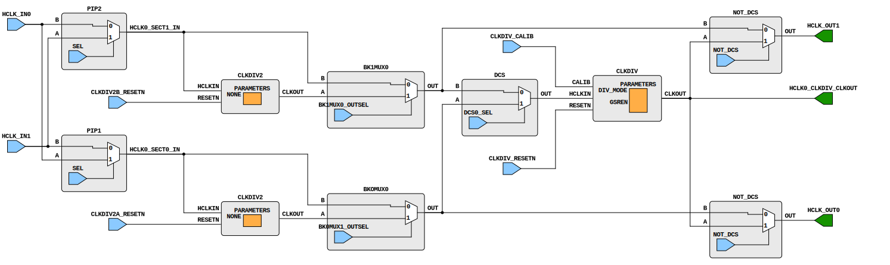
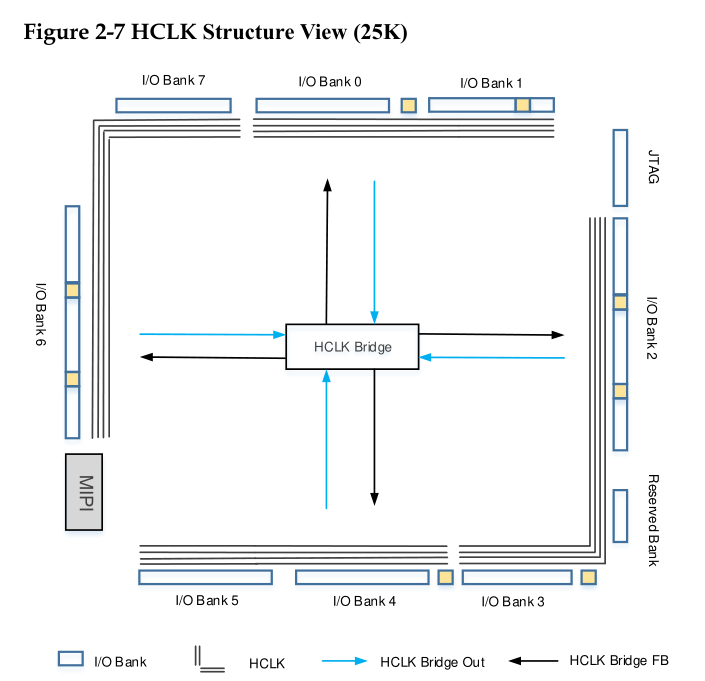
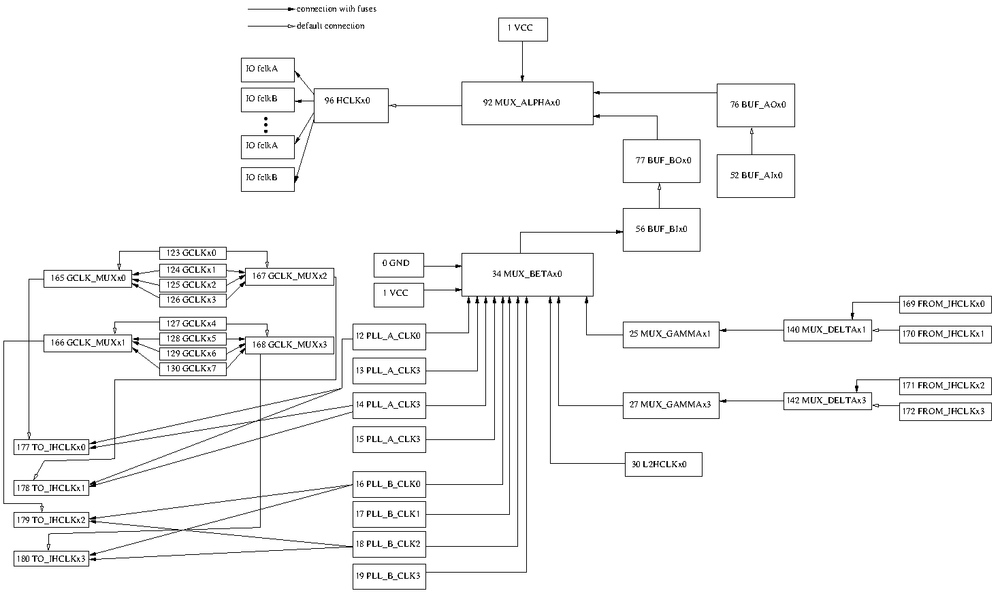
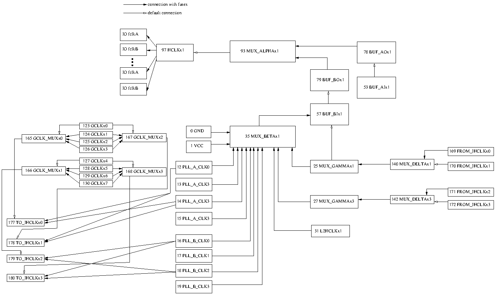
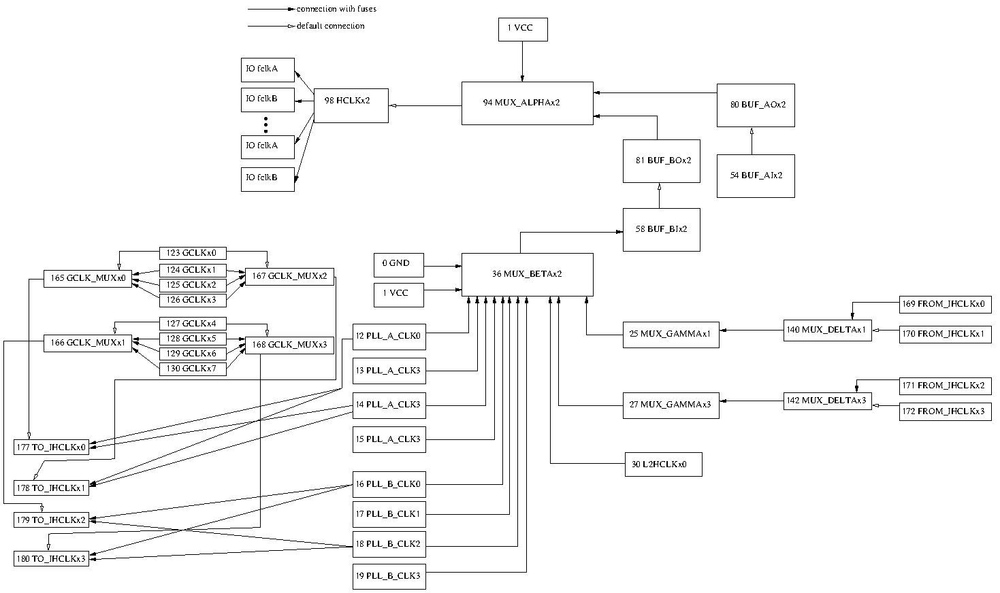
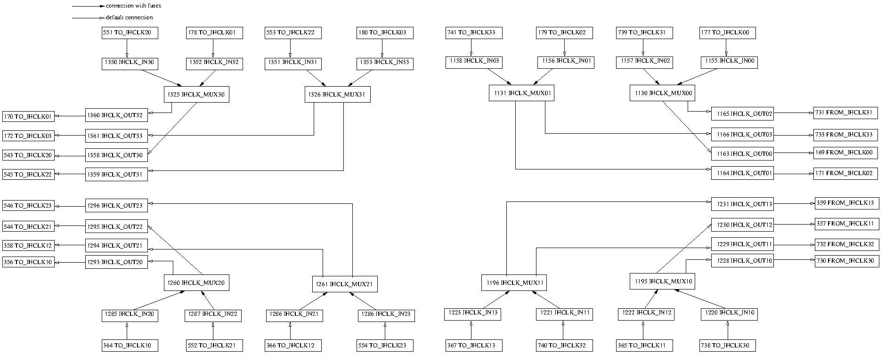

# HCLK

The High-speed CLocK tiles house the `CLKDIV` and `CLKDIV2` bels, among other functions. `CLKDIV` can drive `IOLOGIC`'s `FCLK` (via `HCLK_OUT`) but can also be used as a generic clock source. In contrast, the output of `CLKDIV2` can not be used as a generic clock source; however it can drive `CLKDIV`'s `HCLKIN`, `IOLOGIC`'s `FCLK`, and (per Gowin's documentation), PLLs.

The above diagram shows a prototypical HCLK. The GW1N-9C notably bucks this trend, having some wires repurposed, presumably to enable more direct connections by bypassing some fuses and muxes. It is also worthy of note that in the GW1N-9C, CLKDIV's CLKOUT cannot be connected directly to HCLK_OUT, and must thus take a roundtrip through the centre tiles.

As a general rule, signals in one HCLK section are not allowd to connect to another HCLK section. As such, when the input to CLKDIV comes from one HCLK section, it's output must also go to the same section. For ease with following this rule in PnR, the current implementation of HCLK pretends that there are two `CLKDIVs` rather than one. The GW1N-9C once again breaks the norm, having special wires that connect the output of CLKDIV2 in the upper sections to HCLK_OUT in the lower sections.

`HCLKMUX` (for sharing input signals between HCLKs) and `HCLKEN` are currently undocumented and unsupported ;).

# GW5A-25A HCLK

The HCLK diagram provided in the Gowin documentation. 

Useful information from there:

  - Each IOLOGIC can use one of the four pins from the HCLK block;

  - There are 4 such blocks, and they are not aligned exactly along the chip’s sides—some overlap parts of two adjacent sides;

  - There is an inter-HCLK bridge.

The following diagrams show the results of monitoring the active wires during the compilation of various examples using the Gowin IDE. This is a single HCLK block consisting of four wires connected to IOLOGIC. 

The numbers in the boxes are the wire numbers in the first HCLK block, as listed in the [‘wire’][48] table. The tables do not include fuse descriptions for wires in other HCLK blocks, but starting with number 1122, they contain fuse descriptions for inter-HCLK connections. Therefore, it can be assumed that the fuses for the remaining blocks are the same as those for the first one.

## The first wire of HCLK block 0:

## The first wire of HCLK block 1:

## The first wire of HCLK block 2:

## The first wire of HCLK block 3:

## Inter-HCLK connections

