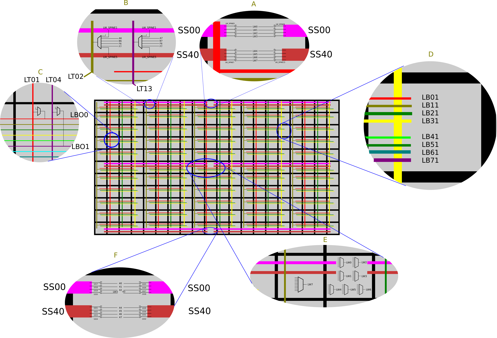

Long wires are used for fast fanout signals. The receivers can be either CLK, CE, SR or LUT inputs. 

You can figure out a lot already from the syntax of the CLOCK_LOC constraint:
 
 CLOCK_LOC "net-name" clocks=fanout [quadrant]

 clocks:
 - BUFG[0-7]  eight master clocks
 - BUFS[0-7]  eight long lines
 - LOCAL_CLOCK "not to route clock line" (???)

 fanout:
 - CLK
 - CE
 - SR set/reset/clear/preset
 - LOGIC jther than the above
 the | can be used as OR.

 So we have 8 long wires per quandrant, which btw can be set as LEFT (L), RIGHT (R) for GW1N series and as TOPLEFT (TL), TOPRIGHT (TR), BOTTOMLEFT (BT) and BOTTOMRIGHT (BR) for GW1N-9/GW1NR-9/GW1N-9C/GW1NR-9C, GW2A series.

The following description focuses on the GW1N-1 chip, which has two quadrants and therefore only long wires with the letter T (top), the chips with four quadrants will also have long wires with the letter B (bottom).

# A
Here the long wires LWT[0-7] are connected to the SS00 and SS40 buses of the left and right quadrants. The corresponding fuses must be reset to 0 in order to connect the long wire to the bus.
There is no choice to which bus (SS00 or SS40), only connect/disconnect.

The buses consist of spines that are different for the right and left quadrant.

| Bus/Code | Spine/Code      | Quadrant |
|:--------:|:---------------:|:--------:|
| SS00 289 | LWSPINETL0 1001 |    Left  |
| SS00 289 | LWSPINETL1 1002 |    Left  |
| SS00 289 | LWSPINETL2 1003 |    Left  |
| SS00 289 | LWSPINETL3 1004 |    Left  |
| SS40 290 | LWSPINETL4 1005 |    Left  |
| SS40 290 | LWSPINETL5 1006 |    Left  |
| SS40 290 | LWSPINETL6 1007 |    Left  |
| SS40 290 | LWSPINETL7 1008 |    Left  |
| SS00 289 | LWSPINETR0 1009 |   Right  |
| SS00 289 | LWSPINETR1 1010 |   Right  |
| SS00 289 | LWSPINETR2 1011 |   Right  |
| SS00 289 | LWSPINETR3 1012 |   Right  |
| SS40 290 | LWSPINETR4 1013 |   Right  |
| SS40 290 | LWSPINETR5 1014 |   Right  |
| SS40 290 | LWSPINETR6 1015 |   Right  |
| SS40 290 | LWSPINETR7 1016 |   Right  |

Fuses (table 38):
| Long wire/Code  | Spine/Code      | Fuses/Bits   |
|:---------------:|:---------------:|:------------:|
|    LWT0 32      | LWSPINETL0 1001 | 1462 (23, 58)|
|    LWT1 33      | LWSPINETL1 1002 | 1455 (19, 59)|
|    LWT2 34      | LWSPINETL2 1003 | 1450 (14, 59)|
|    LWT3 35      | LWSPINETL3 1004 | 1456 (20, 58)|
|    LWT4 36      | LWSPINETL4 1005 | 1625 (24, 0) |
|    LWT5 37      | LWSPINETL5 1006 | 1446 (10, 59)|
|    LWT6 38      | LWSPINETL6 1007 | 1442 (6,  59)|
|    LWT7 39      | LWSPINETL7 1008 | 1642 (27, 59)|
|    LWT0 32      | LWSPINETR0 1009 | 1462 (24, 59)|
|    LWT1 33      | LWSPINETR1 1010 | 1453 (17, 59)|
|    LWT2 34      | LWSPINETR2 1011 | 1449 (13, 59)|
|    LWT3 35      | LWSPINETR3 1012 | 1461 (22, 59)|
|    LWT4 36      | LWSPINETR4 1013 | 1458 (21, 58)|
|    LWT5 37      | LWSPINETR5 1014 | 1445 (9,  59)|
|    LWT6 38      | LWSPINETR6 1015 | 1441 (5,  59)|
|    LWT7 39      | LWSPINETR7 1016 | 1643 (26, 58)|

# B
Connecting the spines with the vertical wires. Here shown is the vertical wire from the `SS40` bus, which is not drawn in the picture of the whole chip because it would result in a mess, but these hidden wires go in pairs with the drawn wires from the `SS00` bus.

Only one spine from each bus is connected, which one is determined from the column of the cell using the table (is specified for the GW1N-1 chip, tables for others can be found in the code):

| Col mod 4 | SS00 spine | SS40 spine |
|:---------:|:----------:|:----------:|
|     0     |     1      |      5     |   
|     1     |     0      |      4     |   
|     2     |     3      |      7     |   
|     3     |     2      |      6     |   

Important: taps are easy to determine, but which columns are served by which tap is a little more difficult to determine by the rule:

If there is a tap to the right of the current tap for a given long wire, then the current tap serves two columns to the right, otherwise all columns to the right.

For example GW1N-1, chip width 20 columns, long wire #1, this is how the columns are serviced with taps:

|   col#  | 0 | 1 | 2 | 3 | 4 | 5 | 6 | 7 | 8 | 9 | 10 | 11 | 12 | 13 | 14 | 15 | 16 | 17 | 18 | 19 |
|:-------:|:-:|:-:|:-:|:-:|:-:|:-:|:-:|:-:|:-:|:-:|:--:|:--:|:--:|:--:|:--:|:--:|:--:|:--:|:--:|:--:|
| tap pip | 0 |   |   |   | 1 |   |   |   | 2 |   |    |    |  3 |    |    |    |  4 |    |    |    |
| cells   | 0 | 0 | 0 | 1 | 1 | 1 | 1 | 2 | 2 | 2 | 2  | 3  |  3 | 3  | 3  | 4  |  4 | 4  | 4  | 4  |

For long wire #2:

|   col#  | 0 | 1 | 2 | 3 | 4 | 5 | 6 | 7 | 8 | 9 | 10 | 11 | 12 | 13 | 14 | 15 | 16 | 17 | 18 | 19 |
|:-------:|:-:|:-:|:-:|:-:|:-:|:-:|:-:|:-:|:-:|:-:|:--:|:--:|:--:|:--:|:--:|:--:|:--:|:--:|:--:|:--:|
| tap pip |   |   |   | 0 |   |   |   | 1 |   |   |    | 2  |    |    |    | 3  |    |    |    | 4  |
| cells   | 0 | 0 | 0 | 0 | 0 | 0 | 1 | 1 | 1 | 1 | 2  | 2  |  2 | 2  | 3  | 3  |  3 | 3  | 4  | 4  |

One more thing quadrants are not squares (horrible): their borders are uneven because the belonging of a cell to one or another quadrant is determined not by its coordinates, but by the coordinates of the tap that serves it.
For example column 9 is central for GW1N-1 so from the table above cells in column 10 belong to the left quadrant for the long wire #1 as column 10 is served by tap in column 8, but the same cell belongs to the right quadrant for the long wire #2 as it is served by tap in column 11.

`A6`, `A7`, `B6` and `B7` wires are segment entry points, i.e. there are Pips of type `LT02 <- A6` etc.

What the `F6`, `F7` inputs are is still unclear.
It is interesting that it is possible to connect the same spine to `LT02` and `LT13`.

# C
Here the vertical taps `LT01` and `LT04` are connected to the horizontal branches `LBO0` and `LBO1`.
As usual the column determines which long wire the branch is connected to, to some extent --- we remember that not only the buses are connected to the taps, but also half a dozen other unknown sources.

And one more thing: the taps are not named `LT02` and `LT13` since they are the actual vertical wire, which can be connected at both ends, there are intermediate wires that indicate the upper or lower end of the wire: для примера `LT02` indicates the upper or lower end of the segment (depending on the coordinates of the wire) and connection `LT01 <- LT02` means that the corresponding end is used as source.

# D
For type 12:

|          | LB01 | LB11 | LB21 | LB31 | LB41 | LB51 | LB61 | LB71 |
|:--------:|:----:|:----:|:----:|:----:|:----:|:----:|:----:|:----:|
|  X01  56 |      |      |      |      |   X  |   X  |   X  |   X  |
|  X02  57 |      |      |      |      |   X  |   X  |   X  |   X  |
|  X03  58 |      |      |      |      |   X  |   X  |   X  |   X  |
|  X04  59 |      |      |      |      |   X  |   X  |   X  |   X  |
|  X05  60 |      |      |      |      |   X  |   X  |   X  |   X  |
|  X06  61 |      |      |      |      |   X  |   X  |   X  |   X  |
|  X07  62 |      |      |      |      |   X  |   X  |   X  |   X  |
|  X08  63 |      |      |      |      |   X  |   X  |   X  |   X  |
| N200  76 |   X  |      |      |      |      |      |      |      |
| N210  77 |      |   X  |      |      |      |      |      |      |
| N220  78 |      |      |   X  |      |      |      |      |      |
| N230  79 |      |      |      |   X  |      |      |      |      |
| N240  80 |      |      |      |      |   X  |      |      |      |
| N250  81 |      |      |      |      |      |   X  |      |      |
| N260  82 |      |      |      |      |      |      |   X  |      |
| N270  83 |      |      |      |      |      |      |      |   X  |
| S200  84 |   X  |      |      |      |      |      |      |      |
| S210  85 |      |   X  |      |      |      |      |      |      |
| S220  86 |      |      |   X  |      |      |      |      |      |
| S230  87 |      |      |      |   X  |      |      |      |      |
| S240  88 |      |      |      |      |   X  |      |      |      |
| S250  89 |      |      |      |      |      |   X  |      |      |
| S260  90 |      |      |      |      |      |      |   X  |      |
| S270  91 |      |      |      |      |      |      |      |   X  |
| E200  92 |   X  |      |      |      |      |      |      |      |
| E210  93 |      |   X  |      |      |      |      |      |      |
| E220  94 |      |      |   X  |      |      |      |      |      |
| E230  95 |      |      |      |   X  |      |      |      |      |
| E240  96 |      |      |      |      |   X  |      |      |      |
| E250  97 |      |      |      |      |      |   X  |      |      |
| E260  98 |      |      |      |      |      |      |   X  |      |
| E270  99 |      |      |      |      |      |      |      |   X  |
| W200 100 |   X  |      |      |      |      |      |      |      |
| W210 101 |      |   X  |      |      |      |      |      |      |
| W220 102 |      |      |   X  |      |      |      |      |      |
| W230 103 |      |      |      |   X  |      |      |      |      |
| W240 104 |      |      |      |      |   X  |      |      |      |
| W250 105 |      |      |      |      |      |   X  |      |      |
| W260 106 |      |      |      |      |      |      |   X  |      |
| W270 107 |      |      |      |      |      |      |      |   X  |
| CLK0 124 |   X  |   X  |   X  |      |   X  |   X  |   X  |   X  |
| CLK1 125 |   X  |   X  |   X  |      |   X  |   X  |   X  |   X  |
| CLK2 126 |   X  |   X  |   X  |      |   X  |   X  |   X  |   X  |
| LSR0 127 |   X  |   X  |   X  |   X  |      |      |      |   X  |
| LSR1 128 |   X  |   X  |   X  |   X  |      |      |      |   X  |
| LSR2 129 |   X  |   X  |   X  |   X  |      |      |      |   X  |
| CE0  130 |   X  |   X  |   X  |   X  |      |      |      |   X  |
| CE1  131 |   X  |   X  |   X  |   X  |      |      |      |   X  |
| CE2  132 |   X  |   X  |   X  |   X  |      |      |      |   X  |

# E
The two cells in the center of the chip with types 81 and 82 are responsible for sources for long wires. Here I also add two adjacent cells with types 83 and 84. 83 contains 7 muxes for lines 40--46 and 84 contains a mux for line 47.

These lines 40--47 are connected to buses `SS00` and `SS40` in the bottom row of the chip. But so far I can't get the vendor IDE to use them so their purpose is unclear.

The `+` marked sources whose locations are known and I will explain how to find them.

|      | LW0 | LW1 | LW2 | LW3 | LW4 | LW5 | LW6 | LW7 | 40 | 41 | 42 | 43 | 44 | 45 | 46 | 47 |
|:----:|:---:|:---:|:---:|:---:|:---:|:---:|:---:|:---:|:--:|:--:|:--:|:--:|:--:|:--:|:--:|:--:|
|  121 |  X  |     |     |     |     |     |     |  X  |  X |    |    |    |    |    |    |  X |
|  122 |     |  X  |     |     |     |     |  X  |     |    |  X |    |    |    |    |  X |    |
|  123 |     |     |  X  |     |     |     |  X  |     |    |    |  X |    |    |    |  X |    |
|  124 |     |     |     |  X  |     |     |     |  X  |    |    |    |  X |    |    |    |  X |
|  125 |     |     |  X  |     |  X  |     |     |     |    |    |  X |    |  X |    |    |    |
|  126 |     |     |     |  X  |     |  X  |     |     |    |    |    |  X |    |  X |    |    |
|  127 |     |  X  |     |     |     |  X  |     |     |    |  X |    |    |    |  X |    |    |
|  128 |  X  |     |     |     |  X  |     |     |     |  X |    |    |    |  X |    |    |    |
|  154 |  X  |  X  |  X  |     |  X  |  X  |  X  |     |  X |  X |  X |    |  X |  X |  X |    |
| +155 |     |  X  |  X  |  X  |     |  X  |  X  |  X  |    |  X |  X |  X |    |  X |  X |  X |
|  156 |  X  |  X  |  X  |     |  X  |  X  |  X  |     |  X |  X |  X |    |  X |  X |  X |    |
| +157 |     |  X  |  X  |  X  |     |  X  |  X  |  X  |    |  X |  X |  X |    |  X |  X |  X |
|  158 |  X  |  X  |     |  X  |  X  |  X  |     |  X  |  X |  X |    |  X |  X |  X |    |  X |
|  159 |  X  |  X  |     |  X  |  X  |  X  |     |  X  |  X |  X |    |  X |  X |  X |    |  X |
|  160 |  X  |     |  X  |  X  |  X  |     |  X  |  X  |  X |    |  X |  X |  X |    |  X |  X |
|  161 |  X  |     |  X  |  X  |  X  |     |  X  |  X  |  X |    |  X |  X |  X |    |  X |  X |
| +162 |  X  |     |     |     |     |  X  |  X  |  X  |  X |    |    |    |    |  X |  X |  X |
| +163 |     |  X  |  X  |  X  |  X  |     |     |     |    |  X |  X |  X |  X |    |    |    |
| +164 |  X  |     |  X  |  X  |     |  X  |     |     |  X |    |  X |  X |    |  X |    |    |
| +165 |     |  X  |     |     |  X  |     |  X  |  X  |    |  X |    |    |  X |    |  X |  X |
| +166 |  X  |  X  |     |  X  |     |     |  X  |     |  X |  X |    |  X |    |    |  X |    |
| +167 |     |     |  X  |     |  X  |  X  |     |  X  |    |    |  X |    |  X |  X |    |  X |
| +168 |  X  |  X  |  X  |     |     |     |     |  X  |  X |  X |  X |    |    |    |    |  X |
| +169 |     |     |     |  X  |  X  |  X  |  X  |     |    |    |    |  X |  X |  X |  X |    |

The `dat` dictionary has a table `UfbIns`, whose entries have the structure `[row number, column number, pip code]`. Thus the entry `[4, 1, 126]` means that CLK2 pip in cell [4, 1] is an entry point to somewhere.
Experimentally it is found that CLK2 are the entry points to the long wire system and it is these points that are marked with a `+` sign in the table above.

The record number in the table `UfbIns` is as the code from the table above minus 104. 

# F
This cell contains a connection to the `SS00` and `SS40` buses of some obscure wires. They cannot be made to be used even if you place all the primitives literally next to the bottom row - the buses in the top row will still be used.

