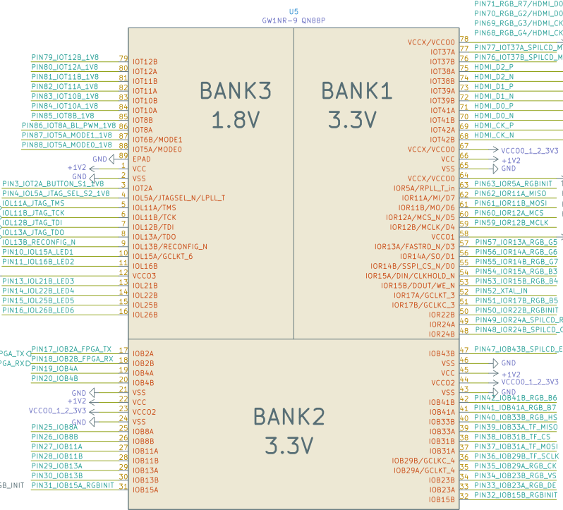
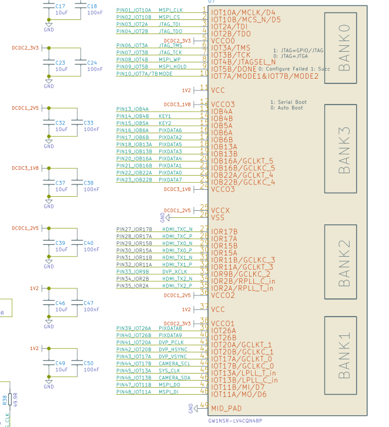
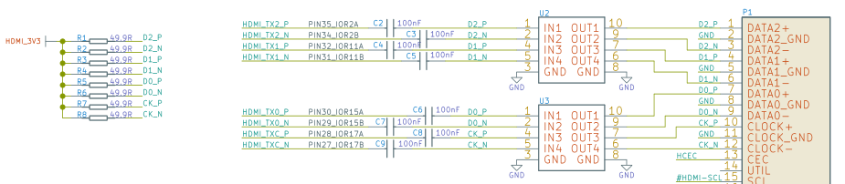
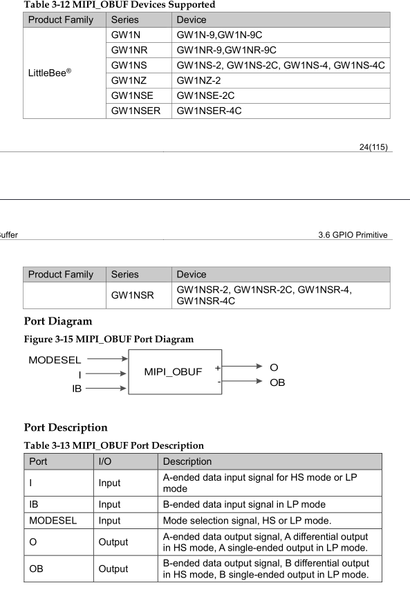
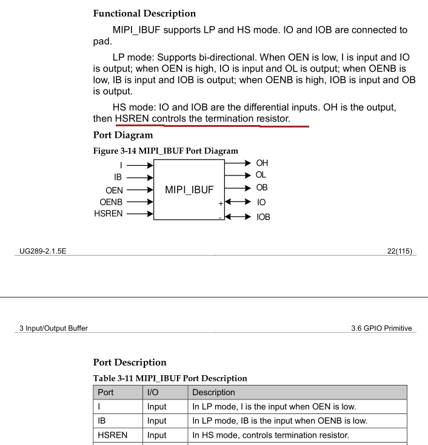
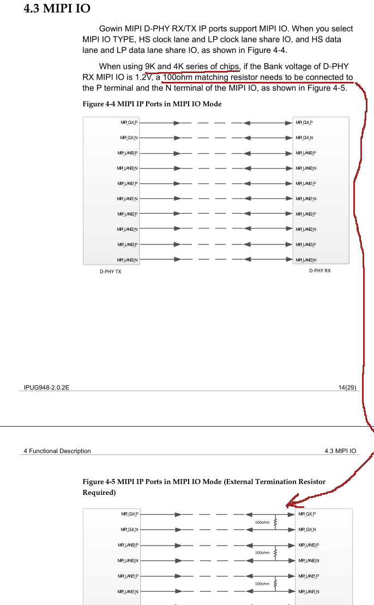

# MIPI features and cautions

In the process of investigating the internals of MIPI implementation in GW1NSR-4C and GW1N-9C chips used on Tangnano4k and Tangnano9k boards the following things were found (at the cost of burnt MIPI camera):

## Voltage

MIPI output pins are located in bank 2 of Tangnano9k and Tangnano4k. The voltages rigidly set by external stabilizers for these banks are 3.3V and 2.5V respectively, which is much higher than 1.2V needed for MIPI. 

I may be wrong, but no combination of voltage setting bits in the FPGA itself can change this fact. 

Less dangerous, but in the case of the Tangnano4k possibly leading to unacceptable results, is the logic level voltages at rigidly fixed bank voltages with MIPI input - 3.3V in the case of bank 0 on the Tangnano4k and 1.8V in case of bank 3 on the Tangnano9k.

All MIPI outputs Tangnano4k are located on the right side of the chip (IORxx) and they are tied with an additional external circuit of resistors, capacitors and obscure chips. The capacitors probably won't affect (although at high speeds it is probably not true anymore), but the resistors to 3.3V will confuse the picture even more.

## Primitives

The MIPI output primitive that is listed as supported on the above chips, namely MIPI_OBUF has very limited applicability.

And this is due to the fact that the ODDR8 etc type logic is physically located in the same IO block and the output of the logic is rigidly non-switchable connected to the I input of the MIPI_OBUF primitive.

We pay special attention to this in order to avoid reports about impossibility of using serializers with this primitive. Use MIPI_OBUF_A.

## Resistor

The MIPI_IBUF primitive has its own mysteries that are worth paying attention to. 

First, remember about voltages, which on Tangnano4k and Tangnano9k are not in the right range at all and therefore you supply 0 to OEN and OENB inputs (thus switching pins to output) only if you are fully aware of what you are doing.

Secondly, there is an interesting note in the bowels of Gowin's MIPI documentation (https://www.gowinsemi.com/en/support/ip_detail/193/):

This suggests that despite the description of HSREN as a control input for the resistor, no control of the resistor connection takes place. It is possible that a switch is made to the differential input, but the external resistor is still required, worse, it is on all the time.

If anyone has any interesting information about the functioning of MIPI primitives we'd love to hear it.

You're warned, use with care what you plug in - I've already lost one MIPI camera in the process :)

