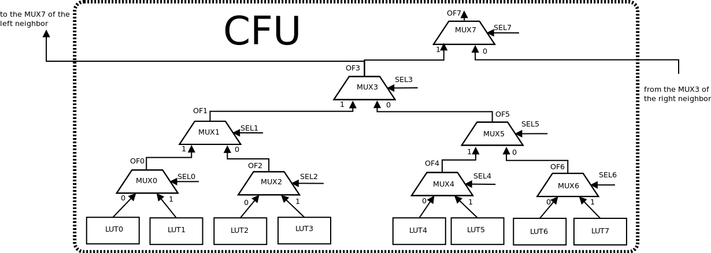

# Muxes

Each CFU contains 8 muxes that are used to create primitives like LUT5, LUT6, LUT7, LUT8, MUX4, MUX8, MUX16 and MUX32. These muxes are interconnected in a certain fixed way and always send the result to the outputs of the muxes: OF0-OF7 using the SEL0-7 switching signals.

These fixed links impose restrictions on the possible placement of primitives:
  * LUT5, LUT6, MUX4, MUX8 can be placed in one CLS;
  * for LUT6, MUX8 CLS index must be even number;
  * LUT7, MUX16 can be placed in one cell;
  * LUT8, MUX32 occupy two cells.
