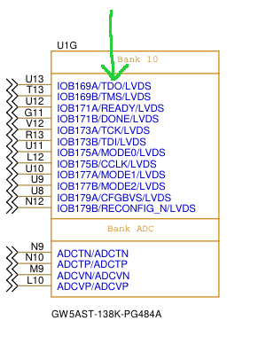

# Importance.

Gowi FPGAs are SRAM-based, so they require programming each time they are powered up. Accordingly, the chip has special pins for this programming. 

Apicula provides the ability to use these pins as GPIO, but you need to be aware of the risks involved - the IO subsystem is complex and its implementation may contain errors, and even if you are absolutely sure of your design, you may still end up with a non-reprogrammable ‘brick’!

In short, using specially designated pins for special purposes as GPIOs is not a healthy practice. 

*You have been warned.*

After this introduction, let's move on to describing dedicated pins.

Pin names are the very names written on the schematic diagram, for example, for 138k in a small fragment of the diagram:

## DONE

Signal indicating whether FPGA programming was successful: VCC - programming successful, GND - error.

Gowin_pack command line argument: --done_as_gpio 

Nextpnr command line argument: not needed

When using as GPIO, it is advisable to provide VCC at startup - as the default value for OUTPUT or (not tested) PULL_MODE=UP for INPUT.

Before programming, it is OPENDRAIN OUTPUT! So bear in mind that a resistor to VCC is usually already soldered on the boards.

## READY

Signal indicating whether FPGA can be programmed: VCC - yes, GND - no.

Gowin_pack command line argument: --ready_as_gpio 

Nextpnr command line argument: not needed

When using as GPIO, it is advisable to provide VCC at startup - as the default value for OUTPUT or (not tested) PULL_MODE=UP for INPUT.

Before programming, it is OPENDRAIN OUTPUT! So bear in mind that a resistor to VCC is usually already soldered on the boards.

## RECONFIG_N

This is a signal for the FPGA to reload its configuration according to the state of the MODE inputs.

Gowin_pack command line argument: --done_as_gpio 

Nextpnr command line argument: not needed

Normal state - VCC. Reprogramming initiation - GND pulse with a duration of at least 25ns.

When using as GPIO, it is advisable to provide VCC at startup - as the default value for OUTPUT. Can not be used as INPUT.

## JTAG

A generalised name for pins responsible for one of the FPGA programming mechanisms.

Gowin_pack command line argument: --jtag_as_gpio 

Nextpnr command line argument: not needed

This includes the following pins:
 - TCK - JTAG clock.
 - TMS - JTAG mode select.
 - TDI - JTAG data input.
 - TDO - JTAG data output.

No particular comments on their use as GPIOs, except that TCK most likely already has a resistor to VCC.

## MSPI

Master SPI. A generalised name for pins responsible for one of the FPGA programming mechanisms. The FPGA acts as the master and downloads programming data from external Flash memory via the SPI protocol.

Gowin_pack command line argument: --mspi_as_gpio 

Nextpnr command line argument: not needed

This includes the following pins:
 - CCLK - configuragion clock.
 - MCSN - case select select.
 - MISO - master-in slave-out in X1 mode, IO1 in X2 or X4 mode.
 - MOSI - master-out slave-in in X1 mode, IO0 in X2 or X4 mode.
 - D02 - IO2 in X4 mode.
 - D03 - IO3 in X4 mode.

In each specific case, you need to look at the schematic diagram - it is possible that the MCSN has a resistor to VCC.

## SSPI

Slave SPI. A generalised name for pins responsible for one of the FPGA programming mechanisms. The FPGA acts as a slave for downloading programming data via the SPI protocol.

Gowin_pack command line argument: --sspi_as_gpio 

Nextpnr command line argument: --vopt sspi_as_gpio

This includes the following pins:
 - SSPI_HOLDN - VCC - sspi works normally, GND - sspi disabled.
 - SSPI_CSN - case select.
 - SSPI_CLK - clock.
 - SSPI_SI - slave input.
 - SSPI_SO - slave output.
 - SSPI_WPN - write protect, VCC - write is enabled, GND - read only.

In the case of TangPrimer25k, you are forced to use SSPI as GPIO because the signal from the external quartz generator is soldered to the SSPI_WPN pin.

## CPU

A generalised name for pins responsible for one of the FPGA programming mechanisms. The FPGA will receive data for programming via a 32-bit bus.

Gowin_pack command line argument: --cpu_as_gpio 

Nextpnr command line argument: not needed

This includes the following pins:
 - D00-D31 - 31 input/output pin. (D01 is DIN).
 - DIN - D01 input/output pin.
 - CSI_B - case selecet input.
 - CSO_B - case select output.
 - RDWR_B - read/write signal.
 - CCLK - configuration clock.

Despite the absence of a CPU in TangPrimer25k and TangMega60k, some pins require switching to GPIO mode for use.

## Serial

A generalised name for pins responsible for one of the FPGA programming mechanisms. The FPGA will receive data for programming via a serial line.

Gowin_pack command line argument: --cpu_as_gpio 

Nextpnr command line argument: not needed

This includes the following pins:
 - DIN - serial input.
 - CCLK - configuration clock.

DIN usually coincides with D01 or D00 of the CPU bus, so the same key is specified for use as GPIO as for CPU pins.

## MODE

MODE[2:0] pins select a mechanism for programmign FPGA. In general, MODE[2:0] pins are hard-configured using resistors or mechanical switches. Considering that they work at the very beginning of programming by selecting the programming method itself, they can be used as GPIO without command line keys, taking into account where the resistors are connected.

Gowin_pack command line argument: not needed

Nextpnr command line argument: not needed

TangPrimer25k does not have MODE switches, but TangMega60k and TangMega138k are inserted into a dock that has such switches, and here is the explanation:

 - 000 - Serial. FPGA acts as master.
 - 001 - MSPI. Read from Flash.
 - 010 - SSPI. FPGA acts as slave.
 - 100 - CPU. FPGA acts as master and reads from external bus.
 - 101 - JTAG only. JTAG always works but in this mode it is the single source.
 - 110 - CPU. FPGA acts as slave.
 - 111 - Serail. FPGA acts as slave.

## PUDC

PullUp During Configuration. VCC - all GPIOs have no pullup, GND - all GPIOs have pull-up, except PUDC pin.

Gowin_pack command line argument: not needed

Nextpnr command line argument: not needed

No action is required to use it as a GPIO, but you need to check the diagram to see where the resistor is soldered.

## CFGBVS

Configuration Bank Voltage Select. Set voltaga of banks 3, 4, and 10 during configuration. VCC - 3.3V, GND - 2.5V.

Gowin_pack command line argument: not needed

Nextpnr command line argument: not needed

No action is required to use it as a GPIO, but you need to check the diagram to see where the resistor is soldered.

## 
